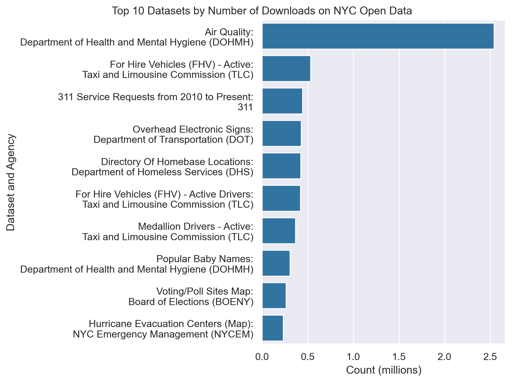

## Socrata Open Data API (SODA) Tutorial Using NYC Open Data 
Author: Mark Bauer

### Table of Contents
* [Introduction](#Introduction)
* [Data](#Data)
* [Tutorials](#Tutorials)
* [Additional Resources](#Additional-Resources)
    * [Socrata Open Data API](#Socrata-Open-Data-API)
    * [Sodapy](#Sodapy)
* [Say Hello!](#Say-Hello)

  

  

  

### Introduction  
This project demonstrates how to:  
- Use the Socrata Open Data API
- Use sodapy (i.e. the python client for the Socrata API)  

And provides:
- Examples of the Socrata Query Language (also known as SoQL)  
- A sample analysis notebook using datasets from NYC Open Data

Inspiration for this project came from the [sodapy GitHub page](https://github.com/xmunoz/sodapy). Much of what I learned about sodapy, as well as working with the Socrata API, came from these developers. I encourage you to review the official sodapy GitHub page to have a better and more complete understanding of sodapy (e.g. installation, requirements, available methods, basic SoQL queries, etc.). This tutorial is meant to complement the official sodapy docs.

### Data  
The dataset used in this project is [311 Service Requests from 2010 to Present](https://nycopendata.socrata.com/Social-Services/311-Service-Requests-from-2010-to-Present/erm2-nwe9) from [NYC Open Data](https://opendata.cityofnewyork.us/).

### Tutorials  
- The Socrata Query Language (SoQL) notebook can be found here [socrata-query-language.ipynb](https://github.com/mebauer/sodapy-tutorial-nyc-open-data/blob/main/socrata-query-language.ipynb).
- The sodapy tutorial notebook can be found here [sodapy-basics.ipynb](https://github.com/mebauer/sodapy-tutorial-nyc-open-data/blob/main/sodapy-basics.ipynb).
- A sample analysis notebook can be found here [analysis.ipynb](https://github.com/mebauer/sodapy-tutorial-nyc-open-data/blob/main/analysis.ipynb).

### Additional Resources 

#### Socrata Open Data API  
The official Socrata Open Data API docs: https://dev.socrata.com/  
Queries using SODA: https://dev.socrata.com/docs/queries/

#### Sodapy  
The official sodapy docs: https://github.com/xmunoz/sodapy  
PyPI: https://pypi.org/project/sodapy/  
Inspiration for this project: https://github.com/xmunoz/sodapy/blob/master/examples/soql_queries.ipynb

### Say Hello!
Contact information:  
Twitter: [markbauerwater](https://twitter.com/markbauerwater)  
LinkedIn: [markebauer](https://www.linkedin.com/in/markebauer/)  
GitHub: [mebauer](https://github.com/mebauer)
