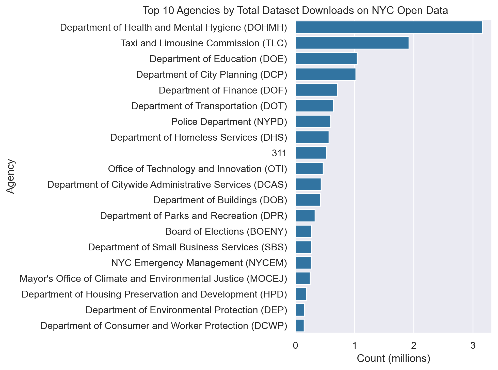

# Socrata Open Data API Tutorial with Python and NYC Open Data 
Author: Mark Bauer

# Table of Contents
* [Introduction](#Introduction)
* [Tutorials](#Tutorials)
* [Data](#Data)
* [Additional Resources](#Additional-Resources)
    * [Socrata Open Data API](#Socrata-Open-Data-API)
    * [Sodapy](#Sodapy)
    * [Other Projects](#Other-Projects)
* [Say Hello!](#Say-Hello)

  

  

  

# Introduction  
Before analyzing a dataset, the first step is acquiring the data. While platforms like Kaggle and data.gov provide a wealth of datasets, one of the most popular platforms for local government data is [Socrata's](https://dev.socrata.com/) open data platform. Many government open data portals, including [NYC Open Data](https://opendata.cityofnewyork.us/), are powered by Socrata, making it a crucial resource for accessing public datasets. Fortunately, Socrata provides a robust and user-friendly API called the [Socrata Open Data API](https://dev.socrata.com/docs/endpoints) (or Socrata API for short), which allows you to extract and interact with these datsets, including metadata. Ultimately, the result of using the Socrata API is more effective, scalable, and reproducible data workflows.

This project is designed to introduce both beginners and experienced users to the capabilities of the Socrata Open Data API. It focuses on how to locate, extract, and query datasets, which is key to performing data analysis. While smaller datasets can be loaded directly into a pandas dataframe from a URL (often in CSV format), larger datasets, such as NYC's 311 dataset which contains nearly 40 million rows, require more efficient methods of data retrieval. The Socrata Open Data API is ideal for this purpose.

For a more comprehensive undertanding of the Socrata API, read the [official documentation](https://dev.socrata.com/).

This tutorial is the one I wish I had when I first started my data science journey, and I hope it helps you make the most of the Socrata API's powerful capabilities.

Quick Note: The inspiration for this project came from the [Sodapy](https://github.com/xmunoz/sodapy) GitHub page, and much of the knowledge I gained about working with Sodapy and the Socrata API was based on the contributions from these developers. I highly recommend reviewing the official Sodapy documentation for a more comprehensive understanding of installation, requirements, available methods, and basic SoQL queries. We will use Sodapy, the Python client for interacting with the Socrata API, throughout this tutorial. Ultimately, this project is intended to complement, not replace, the official Sodapy docs.

# Tutorials  
- Socrata API Basics: [socrata-api-basics.ipynb](https://github.com/mebauer/sodapy-tutorial-nyc-opendata/blob/main/socrata-api-basics.ipynb) Get started with the Socrata Open Data API and the sodapy Python client. This tutorial introduces you to the basics of connecting to Socrata, retrieving data, and working with the API.
- The Socrata Query Language (SoQL): [socrata-query-language.ipynb](https://github.com/mebauer/sodapy-tutorial-nyc-opendata/blob/main/socrata-query-language.ipynb) Learn how to craft powerful queries using the Socrata Query Language (SoQL). This guide covers various methods and techniques for querying data effectively through the Socrata API.
- A sample analysis notebook: [sample-analysis.ipynb](https://github.com/mebauer/sodapy-tutorial-nyc-opendata/blob/main/sample-analysis.ipynb) Explore a sample analysis that highlights popular NYC Open Data datasets. This notebook also includes a quick exploratory data analysis (EDA) of NYC 311 Street Flooding Complaints.

# Data  
- [311 Service Requests from 2010 to Present](https://nycopendata.socrata.com/Social-Services/311-Service-Requests-from-2010-to-Present/erm2-nwe9): All 311 Service Requests from 2010 to present. This information is automatically updated daily.
- [DEP Green Infrastructure](https://data.cityofnewyork.us/Environment/DEP-Green-Infrastructure/spjh-pz7h): NYC Green Infrastructure Program initiatives. Green infrastructure (GI) collects stormwater from streets, sidewalks, and other hard surfaces before it can enter the sewer system or cause local flooding. The GI practice data contained in this dataset includes the location, program area, status, and type of GI. Please visit nyc.gov/dep/gimap to view the DEP Green Infrastructure Map.

# Additional Resources 

## Socrata Open Data API  
- The official Socrata Open Data API documentation: https://dev.socrata.com/  
- Queries using SODA: https://dev.socrata.com/docs/queries/

## Sodapy  
- The official Sodapy documentation: https://github.com/xmunoz/sodapy  
- SoQL inspiration for this project: https://github.com/xmunoz/sodapy/blob/master/examples/soql_queries.ipynb

## Other Projects
Here are some additional projects I've developed that make use of the Socrata API:
- [Data Analysis Using Python: A Beginner’s Guide Featuring NYC Open Data](https://github.com/mebauer/data-analysis-using-python): A beginner-friendly guide to data analysis using Python, featuring real-world datasets from NYC Open Data.
- [Analyzing NYC's 311 Street Flooding Complaints from 2010 to 2020](https://github.com/mebauer/nyc-311-street-flooding): A detailed analysis of NYC's 311 Street Flooding Complaints from 2010 to 2020, with insights on trends and patterns in the data.
- [Flood Data Catalog for NYC: A Comprehensive Inventory on NYC Open Data](https://github.com/mebauer/nyc-flood-data): A curated catalog of flood-related datasets available on NYC Open Data, designed to provide a comprehensive resource for researchers and policymakers.
- [MTA Subway Origin-Destination Ridership Estimate for 2023](https://github.com/mebauer/mta-data): An analysis of subway ridership data to estimate origin-destination patterns for the MTA in 2023.
- [Big Data on NYC Open Data](https://github.com/mebauer/nyc-open-bigdata): Exploring the intersection of big data and NYC Open Data, focusing on large-scale datasets and techniques for handling and analyzing them.

# Say Hello!
Feel free to reach out for further discussions.
- LinkedIn: [markebauer](https://www.linkedin.com/in/markebauer/)  
- GitHub: [mebauer](https://github.com/mebauer)  
- Portfolio: [mebauer.github.io](https://mebauer.github.io/)
